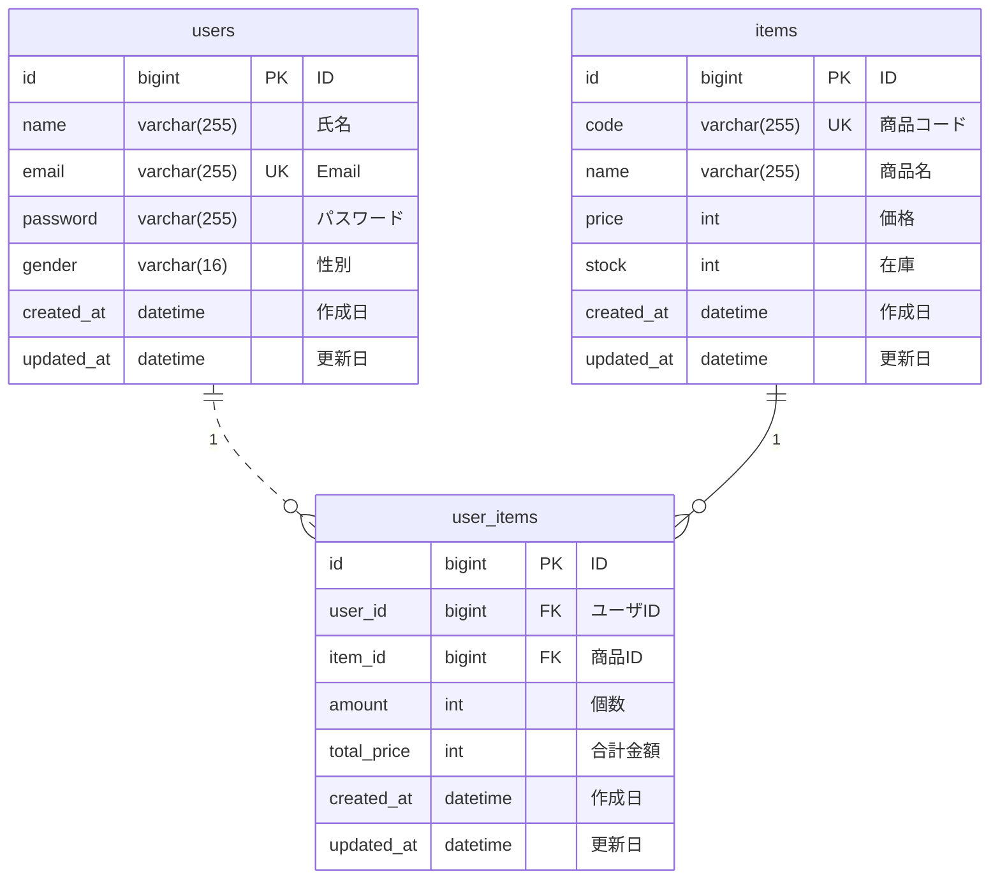

```mermaid
erDiagram
    users {
        id bigint PK "ID"
        name varchar(255) "氏名"
        email varchar(255) UK "Email"
        password varchar(255) "パスワード"
        gender varchar(16) "性別"
        created_at datetime "作成日"
        updated_at datetime "更新日"
    }
    items {
        id bigint PK "ID"
        code varchar(255) UK "商品コード"
        name varchar(255) "商品名"
        price int "価格"
        stock int "在庫"
        created_at datetime "作成日"
        updated_at datetime "更新日"
    }
    user_items {
        id bigint PK "ID"
        user_id bigint FK "ユーザID"
        item_id bigint FK "商品ID"
        amount int "個数"
        total_price int "合計金額"
        created_at datetime "作成日"
        updated_at datetime "更新日"
    }
    users ||..o{ user_items : "1"
    items ||--o{ user_items : "1"
```