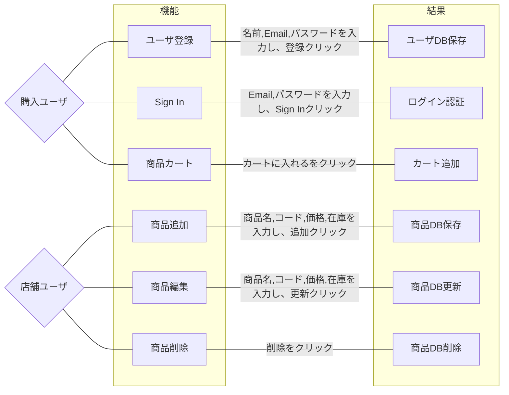

```mermaid
flowchart LR

user{購入ユーザ}
admin{店舗ユーザ}

user --- UA[ユーザ登録]---|名前,Email,パスワードを入力し、登録クリック|UAA[ユーザDB保存]
user --- UB[Sign In]---|Email,パスワードを入力し、Sign Inクリック|UBA[ログイン認証]
user --- UC[商品カート]---|カートに入れるをクリック|UCA[カート追加]

admin --- AA[商品追加]---|商品名,コード,価格,在庫を入力し、追加クリック|AAA[商品DB保存]
admin --- AB[商品編集]---|商品名,コード,価格,在庫を入力し、更新クリック|AAB[商品DB更新]
admin --- AC[商品削除]---|削除をクリック|AAC[商品DB削除]

subgraph 機能
  UA
  UB
  UC
  AA
  AB
  AC
end

subgraph 結果
    UAA
    UBA
    UCA
    AAA
    AAB
    AAC
end
```